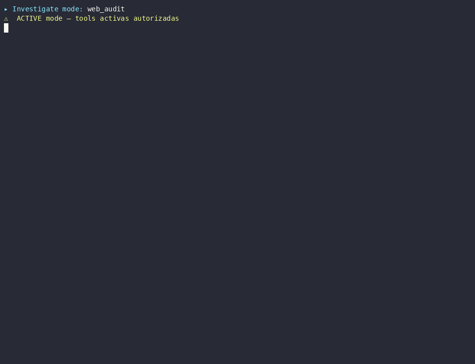

<div align="center">


**Autonomous Cybersecurity Agent — Local-first, Skill-based, Self-improving**

*Compliance audit, pentest, DFIR & incident response from a single prompt.*

[](https://github.com/skyvanguard/Kryon/actions/workflows/ci.yml)
[](https://github.com/skyvanguard/Kryon/actions/workflows/security-scan.yml)
[](https://www.python.org/downloads/)
[](CHANGELOG.md)
[](#skill-system)
[](#architecture)
[](LICENSE)

[Installation](#installation) · [Execution Modes](#three-execution-modes) · [Skill System](#skill-system) · [Architecture](#architecture) · [Playbook Status](#playbook-status) · [POC Reality](#what-runs-today-poc-reality)

<br/>



<sub><i>Real run against OWASP Juice Shop — deterministic detectors surface 22 findings <b>before</b> the LLM, then the agent chains toward impact.</i></sub>

</div>

---

## What is KRYON?

**Kryon is a local-first, autonomous offensive-security agent.** Point it at a target and — from a single prompt — it runs recon, authorized pentesting, vuln hunting, DFIR, or a compliance audit, then hands back findings and a report.

It runs **fully on your own hardware** — a local, OpenAI-compatible LLM served via llama.cpp — so there's **zero API cost and no data leaves the engagement perimeter.** Need more raw capability? Swap to a cloud model with one env var.

> **What makes it different:** the critical detectors run as **deterministic pre-hooks** *before* the model — the LLM narrates evidence, it can't skip the scanner. And coverage grows via `kryon update` (nuclei/CVE/ExploitDB feeds), not a bigger model.

> **Direction (v2.x):** Kryon is a *general* offensive/compliance agent for **any organization**. Its compliance coverage spans many sectors — fintech (PCI-DSS, PSD2/FAPI), healthcare (HIPAA), data protection (GDPR), critical infrastructure (NIS2, OT/ICS), SaaS (SOC 2), defense (CMMC), and general baselines (ISO 27001, CIS, NIST CSF, Zero Trust) — plus edge/infra playbooks (FortiGate, Unifi, Windows, Tomcat, Proxmox, VoIP). **Financial services (LATAM/Paraguay) is one strong vertical** — a real moat (BCP Res. 12/2021 deterministic checks, local-first, guaraní pricing) — **not the whole product**. Some sector playbooks are methodology *templates*, not turnkey scanners; see [Playbook Status](#playbook-status) for what runs end-to-end vs. what's a starter frame.

Architecture is **skill-based**: instead of 33 static Python agents, there is one unified "Kryon" agent that dynamically loads **~110 markdown playbooks** based on target profile and operator intent. Critical detection paths run as **deterministic pre-hooks** (nuclei, nikto, sqlmap, fail2ban check, PCI-DSS validators, …) before the LLM ever gets control — the model **narrates evidence, it cannot skip the detector**.

### One prompt — full engagement

```
$ kryon investigate "audita https://target.com"

 ✶ Kryon [investigate · ReActLoop] · 3 skills matched
 ● pre_hook nuclei -severity critical,high,medium       → 7 templates fired
 ● pre_hook curl -I + CSP+HSTS+Cookies parse            → 3 missing headers
 ● web_fetch_smart https://target.com                   → tech: Apache 2.4.41 / WordPress 6.4
 ● reflection turn 4: "no findings on /wp-admin, pivot to /xmlrpc"
 ● run_command wpscan --url ... --enumerate vp,u        → 2 vuln plugins
 ● writeback_engagement → eng_3e03db5e (chain saved)

╭─ Kryon ─────────────────────────────────────────────────────╮
│ ## Security Assessment: target.com                          │
│ **Findings (HIGH=2, MED=3, LOW=1)** — full chain in report  │
│ CWE-89 SQLi blind boolean on /wp-content/plugins/wpforo     │
│ CWE-79 stored XSS on comment form (auth required)           │
│ Missing: HSTS, X-Frame-Options, CSP                         │
│ Recommendations: 5 actionable items, with rollback commands │
╰─────────────────────────────────────────────────────────────╯

✅ Experience saved + draft skill auto-written (~/.kryon/drafts/)
```

## ⚡ Quickstart

```bash
# 1. Clone + launch the stack (Kali toolchain + local LLM + Kryon)
git clone https://github.com/skyvanguard/Kryon.git && cd Kryon
docker compose -f docker/docker-compose.kali.yml -f docker/docker-compose.override.yml up -d

# 2. Run your first engagement
docker exec -it kryon kryon investigate "audita https://your-target.com"
```

Kryon matches skills to the target, runs its deterministic detectors, then the agent loop, and returns findings + a report. **[Full install & configuration →](#installation)** · **[How it's built →](#architecture)**

---

### At a Glance

| Component | Count |
|-----------|:-----:|
| Skill playbooks (`.md`) | **110** (46 core + 40 imported + 11 CWE + 5 OT + 4 banking + 4 zero-day) |
| `@function_tool` implementations | **362** — banca-safe by default; offensive branches under `KRYON_RED_TEAM` (credential dumping, lateral movement, AD, cloud, DFIR) |
| CLI entry points | 27 subcommands |
| API endpoints (FastAPI) | 140 |
| Compliance framework modules | 12 (PCI-DSS, CIS, NIST CSF, SOC2, ISO 27001, CMMC, DORA, NIS2, Zero Trust, HIPAA, GDPR, PSD2/FAPI) — OWASP/MITRE map via skills |
| Production-capable audit modules | 21 (PCI-DSS · Proxmox · FortiGate · Unifi · Asterisk · Windows · Tomcat · ESXi · KVM · Hyper-V · Xen · MikroTik · Cisco IOS · PostgreSQL · MySQL · nginx · Apache · IIS · Caddy · HAProxy · Linux) |
| Model | any local, OpenAI-compatible LLM via llama.cpp — swappable to any OpenAI-compatible endpoint (local or cloud) |
| LLM runtime | `llama-server` (llama.cpp), tool-calling via `--jinja` |

### Core capabilities

- **Four execution modes** — `engage` (compliance audits), `investigate` (open-ended ReAct loop), `queue process` (multi-target sweep), `schedule` (continuous-monitoring appliance).
- **Deterministic-first** — critical detectors (nuclei, nikto, sqlmap + 11 hybrid probes) run as pre-hooks *before* the LLM; the model converts evidence, it doesn't invent it. OWASP Juice Shop bench: **18 findings / 0 false positives**.
- **Grows without a bigger model** — `kryon update` refreshes the detection feeds (nuclei / CVE / ExploitDB); a self-improving loop auto-drafts new skills from successful engagements.
- **Hallucination guards** — CVE + finding applicability gates drop results that don't match the target's stack (e.g. a JSP CVE on a Node.js host).
- **Deterministic finding validators** — confirmed, not guessed: XSS/SSRF/IDOR replayed headlessly with a single canary GET (no external tool), sqlmap/dalfox/commix for the heavy classes, and an ASAN/canary oracle for SAST findings. Live probes double-gated (`KRYON_REPLAY_FIRE`).
- **Full offensive arsenal** — credential dumping, lateral movement, AD attacks (kerberoast / DCSync / BloodHound), privesc, plus cloud / DFIR / container branches — intrusive tools gated behind `KRYON_RED_TEAM`.
- **Banca-safe by default** — passive recon, throttled nmap, no live probes unless double-gated (`KRYON_*_FIRE=true` + `fire=True`). Safe-modification protocol: diagnose → propose → backup → apply → verify → rollback.
- **Local & private** — runs on your own hardware, zero API cost, no data leaves the host. OpenAI-compatible → swap to a cloud model with one env var.

---

## Execution modes

Kryon has four CLI entry points, each tuned for a different engagement shape.

### 1) `kryon engage` — compliance-driven, plan-based

For PCI-DSS / SWIFT CSP / CIS / NIST audits with a pre-defined phase plan and a deterministic compliance runner. Field-tested on an internal POC across 34 hosts in 3 network segments.

```bash
kryon engage \
  --target 192.168.10.11 \
  --framework pci_dss \
  --orchestrated \
  --auto-approve \
  --client example-internal \
  --engagement-id eng_001 \
  --out ./poc-reports
```

Phase plan loaded from `pyproject.toml` profiles; each phase re-matches skills against `phase_name + objective + target` and runs that skill's `pre_hooks:`. PDF report + JSON findings + reproducibility hash per engagement.

### 2) `kryon investigate` — open-ended ReAct loop

For exploratory work: "audita esta URL", "qué CVEs aplican a nginx 1.18", SAST sobre código local. ReAct stack: Observation → Reflection → Decision → Action → Verification, with stuck-pattern detection that breaks loops before wall-budget exhaustion.

```bash
# Banca-safe (passive: web_fetch_smart + RAG + 11 hybrid detectors)
kryon investigate "audita https://target.com"
kryon investigate --url https://target.com
kryon investigate ./local/path/             # SAST on local source

# Active (requires written authorization)
kryon investigate "active sqli pentest contra https://target" --active

# Active + red-team tools (jwt_crack, hydra, ffuf, playwright)
KRYON_RED_TEAM=true kryon investigate "active rce pentest contra http://lab" --active
```

| Mode | Flag | Tools available | Pre-hooks fired |
|------|------|-----------------|-----------------|
| **PASSIVE** (default) | — | `web_fetch_smart`, RAG queries, DNS lookup | Hybrid-mode deterministic only |
| **ACTIVE** | `--active` | + nmap, nuclei, sqlmap, etc. | ALL (incl. explicit-keyword skills) |
| **ACTIVE + RED-TEAM** | `--active` + `KRYON_RED_TEAM=true` | + 21 red-team tools | ALL |

**14 explicit-keyword active skills** cover OWASP Top-10 + API + JS-ecosystem. They activate ONLY with the literal phrase `"active <X> pentest"` (or `"fire <X> probe"` / `"pentest activo <X>"`) — preventing pre-hook regression on broad-keyword triggers.

### 3) `kryon discover --queue-add` + `kryon queue process` — multi-target POC

For segment-wide POCs (CIDR not supported on `engage` directly). Discovers live hosts, queues them, then drains the queue invoking `engage` per item — banca-safe serial by default.

```bash
# 1. Discover + enqueue (throttled nmap)
KRYON_NMAP_TIMING=T2 KRYON_NMAP_MIN_RATE=50 \
  kryon discover --subnet 10.x.x.0/24 --queue-add --output disc.json

# 2. Drain — sequential, no auto-retry on failure (manual triage)
kryon queue process \
  --concurrency 1 \
  --framework pci_dss \
  --orchestrated \
  --auto-approve \
  --client example-internal \
  --out ./poc-reports
```

`--limit N` cuts after N items. Failed items stay in `status=failed` for triage — no silent retries (avoids duplicate destructive actions on banking hosts).

### 4) `kryon schedule` — continuous monitoring (appliance)

Turns Kryon from a one-shot scanner into a monitor. The product is not the scan — it's the **diff**: what changed since last run, forwarded to a SIEM (Wazuh / Splunk / Elastic / QRadar) and rendered as a plain-language "novedades" report (`.md` + branded PDF).

```bash
# Refresh detection feeds first (nuclei-templates, ExploitDB, NVD CVE cache)
kryon update

# Schedule a nightly feed-refresh, then a nightly segment sweep
kryon schedule add --id feeds  --update --cron "0 2 * * *"
kryon schedule add --id seg-10 --subnet 10.0.0.0/24 --cron "0 3 * * *" --framework pci_dss
kryon schedule run-due --watch --interval 60      # in-process daemon
```

Each scan diffs against the saved baseline into four buckets — **new / worsened / resolved / stable** — masking volatile-token noise (timestamps, session ids) so a bumped banner isn't a false "changed". A warm-up run establishes the baseline silently, so the first night on a new target isn't an alert avalanche. `KRYON_NOTIFY_DRIFT=true` + `KRYON_SIEM_TYPE=wazuh` wire the alerting.

---

## Skill System

Kryon's intelligence lives in **110 markdown playbooks** organized by purpose. Skills are **auto-matched** by target tech, open ports, and user keywords. Priority-based selection with a token budget cap (max 15 tools to fit a 16K-context active engagement).

```
src/kryon/skills/playbooks/
├── ~42 core skills         recon-scout, pentest, vuln-hunter, appsec,
│                            forensics, ctf-master, ssl-audit, server-hardening,
│                            safe-modification, rollback-recovery,
│                            tomcat-audit, fortigate-audit, unifi-audit,
│                            voip-asterisk-audit, dvr-audit, hackerone-engagement,
│                            burp-integration, http-fetch, evidence-forensics,
│                            cryptanalysis-techniques, browser-exploit,
│                            memory-corruption-exploits, binary-reverse-engineering, …
├── banking/ (4 .md files)  pci-dss-audit, audit-bank-full, proxmox-audit,
│                            cis-controls-v8.1
│                            ⚠ core-banking-assessment, mobile-banking-audit,
│                            atm-security, payment-gateway-testing, fraud-detection
│                            are *methodology templates* (not shipped .md playbooks).
│                            swift-network-security + open-banking-api now ship a
│                            deterministic runner/validator — see Banking Status.
├── cwe-detection/ (11)     CWE-22, CWE-78, CWE-79, CWE-89, CWE-125, CWE-20,
│                            CWE-287, CWE-352, CWE-502, CWE-639, CWE-918
├── ot/ (5 skills)          modbus, dnp3, iec104, s7, mqtt-industrial
├── imported/ (40 skills)   from mukul975/Anthropic-Cybersecurity-Skills
│                            (Apache 2.0, MITRE ATT&CK / NIST CSF mapped)
├── zero-day/ (4 skills)    source-review / variant-analysis harness
│                            (intra-tree + recent-CVE patch-diff seeding)
└── pre_hooks/              Python escape-hatch helpers (sqlmap, IDOR probe)
```

### Pre-hooks — deterministic-first execution

A skill can declare a YAML list of tool invocations that run **before** the LLM gets control. Output is injected as authoritative context — the model narrates findings, it cannot skip the detector.

```yaml
---
name: vuln-hunter
priority: 30
required_tools: [nuclei_scan, run_command]
pre_hooks:
  - tool: nuclei_scan
    args: { target: "{ctx.target}", severity: "critical,high,medium" }
  - tool: run_command
    args: { command: "nikto -h {ctx.target} -Tuning x6 -maxtime 60" }
  - python: ./pre_hooks/sqlmap_rest_login_hook.py:run
---
```

Currently wired in: `fortigate-audit`, `unifi-audit`, `proxmox-audit`, `pci-dss-audit`, `audit-bank-full`, `vuln-hunter`, `ssl-audit`, `appsec`, `wordpress-audit`, the 14 explicit-keyword active skills, the 11 CWE-detection skills, and the 6 banking skills.

### `/skill` REPL commands

```bash
KRYON> /skill list                      # All 110 loaded
KRYON> /skill show recon-scout          # View playbook content
KRYON> /skill search kubernetes         # Search upstream catalog (754 skills)
KRYON> /skill import exploiting-zerologon-vulnerability-cve-2020-1472
KRYON> /skill reload                    # After editing a .md
KRYON> /skill drafts                    # Auto-generated drafts pending review
KRYON> /skill review <draft>            # Inspect a draft
KRYON> /skill promote <draft>           # Promote draft to active skill
KRYON> /skill scores                    # Wilson-scored skill ranking
KRYON> /skill auto detect               # Trigger pattern detector
```

### Custom skills

Drop a `.md` in `src/kryon/skills/playbooks/`:

```yaml
---
name: my-custom-audit
description: "My specialized playbook"
triggers:
  tech: ["nginx"]
  keywords: ["nginx hardening", "reverse proxy audit"]
priority: 20
required_tools: [run_command, nuclei_scan]
pre_hooks:
  - tool: run_command
    args: { command: "curl -sI https://{ctx.target}" }
---

## Workflow
1. Verify nginx version + EOL status
2. Check TLS config (ciphers, HSTS, OCSP stapling)
3. ...
```

---

<details>
<summary><b>♻️ Self-improving loop — how Kryon auto-drafts new skills (click to expand)</b></summary>

| Layer | Purpose | Trigger |
|-------|---------|---------|
| **Drafting** | Every successful engagement writes a draft `.md` to `~/.kryon/drafts/` via `skill_synthesizer.py` + `draft_writer.py` | Auto on engage exit |
| **Scoring** | `skill_scorer.py` uses Wilson 95%-lower-bound confidence + reusability axis. Activate with `KRYON_SKILL_RANKING=hybrid` or `=dual` | Per-selection telemetry to JSONL |
| **Auto-creation** | `pattern_detector.py` (Jaccard clustering) + LLM-assisted body + `skill_evaluator.py` (CWE → tools gate, hallucinated tools rejected) + `auto_pipeline.py` | Manual: `/skill auto detect` |

CWE map override: `~/.kryon/cwe_map.yaml` (or set `KRYON_CWE_MAP`).

every auto-generated draft now gets a sidecar `.eval.json` with `guide_score` (relevance + naturalness, threshold 0.6).

</details>

---

## Architecture

```
                           ┌─────────────────────────────────────┐
                           │   kryon CLI (27 subcommands)        │
                           │   engage · investigate · queue ·    │
                           │   discover · approve · doctor · …   │
                           └────────────────┬────────────────────┘
                                            │
                                            ▼
                  ┌─────────────────────────────────────────────────┐
                  │   skills/  (PRIMARY interface in v2.x)          │
                  │   ┌────────────────────────────────────────┐    │
                  │   │ loader.py — match by tech/ports/kw     │    │
                  │   │ tool_budget.py — cap @ 15 tools        │    │
                  │   │ unified_agent.py — compose prompt      │    │
                  │   │ pre_hook_runner.py — deterministic-1st │    │
                  │   └────────────────────────────────────────┘    │
                  │   playbooks/  (110 .md files)                   │
                  └────────────┬────────────────────┬───────────────┘
                               │                    │
                               ▼                    ▼
            ┌──────────────────────────┐  ┌────────────────────────────┐
            │ sdk/agents/ (run loop)   │  │ tools/ (362 @function_tool)│
            │ ┌──────────────────────┐ │  │ 52 categories:             │
            │ │ Runner               │ │  │ reconnaissance, web,       │
            │ │ models/openai_native │ │  │ network, ad, cloud,        │
            │ │  + harmony_parser    │ │  │ container, forensics,      │
            │ │  + tool name fixes   │ │  │ exploitation, dfir,        │
            │ │ ReflectiveRunner     │ │  │ banking, ot, validation…   │
            │ └──────────────────────┘ │  └────────────────────────────┘
            └──────────┬───────────────┘
                       │
                       ▼
      ┌──────────────────────────────────────────────────────────────┐
      │ Cross-cutting subsystems                                     │
      │                                                              │
      │ services/  context mgmt (micro_compact, session_memory,      │
      │            tool_output_cap, auto_extract)                    │
      │ learning/  ChromaDB experiences + self-improving skill loop  │
      │ knowledge/ NVD + ExploitDB + writeups (embedding RAG OFF)    │
      │ compliance/ 12 frameworks (PCI-DSS, CIS, SWIFT, …) runners   │
      │ reporting/ PDF/DOCX/HTML, reproducibility hashes             │
      │ memory/    SQLite store (16 migrations) — engagements, KB    │
      │ server/    FastAPI — 140 endpoints, single-tenant, JWT/RBAC  │
      │ approval/  Human-in-the-loop for destructive actions         │
      └──────────────────────────────────────────────────────────────┘
                       │
                       ▼
              ┌────────────────────────┐
              │ llama-server (llama.cpp)│
              │  local OpenAI-compat   │
              │  LLM (swappable)       │
              └────────────────────────┘
```

<details>
<summary><b>🔬 Execution flow — a full <code>kryon investigate</code> trace (click to expand)</b></summary>

```
1. ParseArgs(url) ──▶ ReflectiveRunner(max_turns=N, reflect_every=4)
2. SkillLoader.match(url, intent) ──▶ 3-5 skills selected
3. ToolBudget.select(skills) ──▶ 30 tools wired to runner
4. _run_deterministic_phase(url) — hybrid mode
       ├── _check_http      ──▶ headers, redirects, tech fingerprint
       ├── _check_mysql     ──▶ banner, auth attempt
       ├── _check_ssh       ──▶ banner, ciphers
       └── (8 more detectors) ──▶ findings injected as GROUND TRUTH
5. pre_hooks of matched skills
       ├── nuclei_scan      ──▶ severity-prioritized top-N
       ├── nikto            ──▶ deduped by bracketed-id regex
       └── sqlmap (Python)  ──▶ JSON POST body discovery
6. LLM agent loop  (max_turns=8 reasoning / 5 instruct)
       observation ──▶ reflection (every 4 turns) ──▶ decision ──▶ action ──▶ verify
7. _parse_agent_findings
       ├── CVE applicability gate (drops e.g. a JSP CVE on a Node.js host)
       ├── Finding applicability gate (scans message+evidence for product kw)
       └── KRYON_DEBUG_PARSE=true ──▶ JSONL trace
8. writeback_engagement ──▶ ChromaDB + ~/.kryon/drafts/<auto>.md
```

</details>

---

## Installation

### Requirements

- **Python 3.10+** (managed by [`uv`](https://github.com/astral-sh/uv))
- **Docker** (Kali Linux + 200+ security tools pre-installed)
- **A local LLM** — any OpenAI-compatible model served via llama.cpp (a GPU helps but isn't required; size the model to whatever hardware you have). Or point Kryon at a cloud endpoint instead.
- **GitHub CLI** (`gh`) for `/skill import` from upstream catalog

### Docker deployment (recommended)

```bash
git clone https://github.com/skyvanguard/Kryon.git
cd Kryon

# Copy environment template
cp docker/.env.docker.example docker/.env.docker

# Launch stack (Kali + llama-server + Kryon, GPU passthrough)
docker compose -f docker/docker-compose.kali.yml \
               -f docker/docker-compose.override.yml \
               --env-file docker/.env.docker up -d

# The `llama-server` service of the compose file serves your local model —
# mount any OpenAI-compatible GGUF and it exposes an OpenAI-compatible API
# on :8080 with tool-calling enabled via `--jinja`. There is no model-build
# step: llama.cpp loads the GGUF directly on startup. Verify it is up with:
docker exec kryon curl -s http://llama-server:8080/v1/models

# (Embedding RAG is OFF by default — see "knowledge/" notes below.)

# (Optional) Refresh detection feeds (nuclei-templates, ExploitDB, CVE cache)
docker exec -it kryon kryon update

# Launch the interactive TUI
docker exec -it kryon kryon tui
```

<details>
<summary><b>⚙️ Configuration profiles — engagement env vars (click to expand)</b></summary>

#### Banca-safe (compliance audits — default)

```bash
# docker/.env.docker
KRYON_MODEL=kryon-local                  # alias for whichever local model your llama-server serves
                                     # (already the default, so you can omit this line)
KRYON_AGENT_TYPE=kryon
KRYON_UNIFIED=true
KRYON_FORCE_TOOL_TURNS=8               # local LLM tool-calling reliability
KRYON_MEMORY=true
KRYON_STREAM=false                     # Stable REPL

# Throttled scanning (banking-friendly during business hours)
KRYON_NMAP_TIMING=T2
KRYON_NMAP_MIN_RATE=50
KRYON_NMAP_MAX_PARALLELISM=10
KRYON_NUCLEI_RATE_LIMIT=50
KRYON_NUCLEI_BULK_SIZE=10
KRYON_NUCLEI_CONCURRENCY=10

# CVE / finding applicability gates (drop hallucinated cross-stack CVEs)
KRYON_CVE_CACHE_REQUIRED=true
KRYON_CVE_APPLICABILITY=true           # default
KRYON_FINDING_APPLICABILITY=true       # default
```

#### Active pentest (authorized targets only)

```bash
# Add to banca-safe block
KRYON_REASONING_EFFORT=medium          # — only when pre-hooks active
KRYON_PHASE_TURNS=10                   # — bump from auto-8
KRYON_RED_TEAM=true                    # Unlock 21 red-team tools

# ENGAGEMENT CAGE — hard authorization enforced at the tool-execution layer (not
# a prompt — a technical gate). The agent physically cannot act outside its
# written authorization, even running fully autonomously. Three axes; any one set
# turns the cage ON, all unset = off (backward compatible):
#   WHERE — scope: every tool call's target validated against the allowlist
KRYON_SCOPE=10.65.168.0/24,*.creative.thm,https://app.target.com
KRYON_SCOPE_DENY=10.65.168.1           # optional hard deny (e.g. the gateway)
#   WHEN — engagement window: out of window → every tool blocked
KRYON_ENGAGEMENT_START=2026-06-18T02:00:00Z
KRYON_ENGAGEMENT_END=2026-06-18T06:00:00Z
#   WHAT — action tier ceiling: passive < active < exploit < post. Tools above
#   the ceiling are refused (e.g. 'active' allows scanning, blocks exploit/post)
KRYON_MAX_TIER=active
```

Network egress cage (defense-in-depth, OS level — caps subprocess tools + obfuscated
targets the software gate's regex can miss). Generated from `KRYON_SCOPE`, applied
in the container (needs `NET_ADMIN`, already granted):

```bash
python -m kryon.agents.network_egress apply        # default DROP egress except scope + DNS + LLM
python -m kryon.agents.network_egress              # dry-run: print the iptables ruleset
```

Kill-switch — hard external stop for an autonomous run (checked at the tool layer;
tripping STOPS the run). Bounds HOW MUCH the agent acts and lets a human pull the
plug. Any one set turns it on:

```bash
KRYON_KILL_FILE=/tmp/kryon.stop        # `touch` this file to abort mid-run
KRYON_DEADLINE=2026-06-18T06:00:00Z    # hard wall-clock stop
KRYON_MAX_ACTIONS=200                  # cap total tool calls this run
```

#### Switch to DeepSeek (higher recall, off-perimeter)

The hardened harness is model-agnostic; flipping to a stronger cloud model is one
step. `deepseek-chat` (V3) uses the native path; `deepseek-reasoner` (R1)
auto-routes to litellm for the `reasoning_content` round-trip. Misconfig (missing
key / wrong base_url / stale `KRYON_LOCAL_LLM`) is flagged fail-fast at startup so
a paid run isn't wasted.

```bash
KRYON_MODEL=deepseek-chat
OPENAI_BASE_URL=https://api.deepseek.com
OPENAI_API_KEY=sk-...                   # real DeepSeek key
KRYON_LOCAL_LLM=false                   # cloud, not the local server
```

# Live-probe gates (DOUBLE gate: env + fire=True argument)
KRYON_BOLA_FIRE=true                   # detect_bola live HTTP
KRYON_GRAPHQL_FIRE=true                # graphql_recon live HTTP
KRYON_RETEST_FIRE=true                 # retest_finding live HTTP
KRYON_BRAND_FIRE=true                  # typosquat_scan live DNS
KRYON_REPLAY_FIRE=true                 # replay_xss/ssrf/idor deterministic validators
```

</details>

---

<a id="playbook-status"></a>

<details>
<summary><b>🎯 Playbook status — production-ready vs template, across all verticals (click to expand)</b></summary>

Not every playbook is turnkey today. Kryon spans infra/edge (FortiGate, Unifi, Windows, Tomcat, Proxmox, VoIP), web/app, and sector-specific playbooks (banking, payments, healthcare) — here's what runs end-to-end vs. what's a methodology frame:

| Playbook | Status | Notes |
|---|---|---|
| **`pci-dss-audit.md`** | ✅ **production-capable** | **21 deterministic checks** across PCI requirements 1·2·4·5·6·7·8·10·11 — incl. **1.4.1** (host firewall), **4.2.1** (strong TLS), **5.2.1** (anti-malware), **6.4.3** (payment-script SRI + CSP), **7.2.1** (least-privilege file perms), **8.4.3** (SSH MFA, FIDO2/WebAuthn-aware), **10.3.1** (audit-log protection), **11.5.1** (IDS/IPS). Reproducibility-hashed. SAQ B/C/D scoping. |
| **`proxmox-audit.md`** | ✅ **production-capable** | **17 deterministic PVE checks** — web/API SSL+auth, SSH (key-only + ciphers + fail2ban + **kernel sysctl**), MFA + **named users**, API tokens, firewall (deny + logging), patching (version + repo-hygiene + **auto-upgrades**), cluster quorum, time-sync, **backup jobs**. Validated in internal pilot. |
| **`audit-bank-full.md`** | ✅ **production-capable** | orchestrates the three core audits + multi-framework PDF. |
| **`fortigate-audit.md`** | ✅ **production-capable** | **28 checks** (FGT-1.1..FGT-6.3) wired to `run_compliance_audit(framework="fortigate")` — admin hardening (incl. 1.7 GUI-TLS, 1.8 password-policy, 1.9 maintainer), services (incl. 2.5 strong-crypto), SSL-VPN, logging, patching + **firewall policy hygiene** (6.1 no allow-all, 6.2 accept-policy logging, 6.3 UTM profiles). CIS Fortinet Benchmark + CVE catalog (CVE-2022-42475, CVE-2024-21762, CVE-2024-23113). Read-only via SSH. |
| **`unifi-audit.md`** | ✅ **production-capable (controller)** + 📝 template (WiFi capture) | 18 controller checks via `mongo --port 27117 ace`. Hash estable. Active WiFi capture runs on operator host. |
| **`voip-asterisk-audit.md`** | ✅ **production-capable** | 8 checks (VOIP-1.1..VOIP-3.3): anonymous register / AMI default secret / allowguest / AMI WAN / SRTP / SIP-TLS / version currency. |
| **`windows-server-audit.md`** | ✅ **production-capable** | 15 checks (WIN-1.1..WIN-4.2) via WinRM: SMBv1 / LSA / PrintNightmare / Defender RTP / firewall / BitLocker / LLMNR / WSUS / LAPS / audit policy / RDP NLA / UAC / EDR. |
| **`tomcat-audit.md`** | ✅ **production-capable** | 8 checks (TOMCAT-1.1..TOMCAT-2.4): EOL versions / AJP 8009 Ghostcat (CVE-2020-1938) / Manager+Host Manager exposure / version leak / /docs + /examples deployed. |
| **`dvr-audit.md`** | 📝 recon-only template | Dahua/Hikvision/ONVIF fingerprint + nuclei CVE templates (CVE-2017-7921, CVE-2021-33044/45, CVE-2021-36260). Custom checks v2 post-POC. |
| `core-banking-assessment.md` | 📝 template | T24/Flexcube/Finacle/Bantotal — methodology + checklist only. Needs vendor sandbox per engagement. |
| `swift-network-security.md` | 🟡 runner + template | **CSCF v2026** (25 mandatory + 7 advisory): 17 deterministic host checks (`swift-csp-2026.yaml`, SWIFT-1.1..7.2) wired to `run_compliance_audit(framework="swift-csp")`, covering principles 1·2·4·5·6·7. SWIFT-component controls (Alliance Access/Connect, HSM) + the now-mandatory 2.4M back-office data flow need partner attestation. NOT a KY3P replacement. |
| `atm-security.md` | 📝 template | Requires physical access + NCR/Diebold lab + PCI-PTS certified team. |
| `open-banking-api.md` | 🟡 validator + template | FAPI 1.0 Advanced **discovery-doc validator** (10 read-only checks: PAR, PS256/ES256, mTLS/DPoP, PKCE S256, no-implicit, JARM, SCA ACR/AMR) wired to the **PSD2 RTS** compliance mapper. Banca-safe (read-only, live fetch double-gated). Full authenticated flow (per-bank mTLS certs + client_id) is still per-engagement. |
| `payment-gateway-testing.md` | 📝 template | Bancard/Infonet/Stripe/MercadoPago. Checklist only. |
| `fraud-detection.md` | 📝 template | Interview + rule-review guide, not a technical scan. |
| `mobile-banking-audit.md` | 📝 template | Frida/objection/jailbroken device outside the container. |

**Rule of thumb**: ✅ = end-to-end deterministic + reproducibility hash. 📝 = methodology guide; execution requires manual steps and vendor-specific access.

---

### What runs today (POC reality)

End-to-end proven in production engagements:

- **Internal POC (2026)** — 34 hosts across 3 segments (VoIP, workstations, servers), low-impact during business hours via operator VPN. 11 systemic findings, 0 false positives. 26 new Kryon features shipped from POC feedback.
- **OWASP Juice Shop bench** — avg 18 findings, 0 FPs, 3/3 SATISFIED (n=3 reproducible). Ground truth: 10 canonical CWEs (CWE-89/79/639/285/200/22/352/915/1004/319).
- **HackTheBox-style walkthrough bench** — 4/7 PWN rate (chain_match 100%) on web-only ready set (SQLi, XSS, IDOR, RCE, SSRF, CSRF, XXE). Note: `ready_url` points to PortSwigger docs, NOT the live lab. Measures **reasoning over documentation**, not live exploit.
- **Juliet SAST bench** — 67.1% recall + 15% FPR @ HIGH.

Edge-network coverage (FortiGate + Unifi + VoIP + Windows + Tomcat) extends the data center perimeter all the way to WiFi and PBX.

</details>

---

<details>
<summary><b>🎯 Use cases — end-to-end examples (compliance · bug bounty · CTF · DFIR · hardening) (click to expand)</b></summary>

### Compliance audits (multi-sector)

```bash
kryon engage --target 192.168.10.11 --framework pci_dss --orchestrated
kryon engage --target fw01.corp --framework fortigate --orchestrated
kryon engage --target unifi.corp --framework unifi --orchestrated
kryon engage --target dc01.corp --framework windows --orchestrated
```

### Bug bounty / authorized pentest

```bash
KRYON_RED_TEAM=true kryon investigate "active sqli pentest contra https://target" --active
KRYON_RED_TEAM=true kryon investigate "active rce pentest contra http://lab"     --active
KRYON_RED_TEAM=true kryon investigate "active idor pentest contra api.target"    --active
```

### CTF / HackTheBox

```bash
KRYON_RED_TEAM=true kryon investigate "resolvé esta máquina: 10.10.10.5" --active
```

### Forensics & incident response

```bash
KRYON> /agent select forensics
KRYON> analizá este memory dump con volatility
KRYON> investigá este phishing email (eml adjunto)
KRYON> detectá lateral movement en los logs
```

### Server hardening (SSH remediation)

```bash
kryon engage --target 192.168.1.10 --ssh-user admin --ssh-key ~/.ssh/id_ed25519 \
             --framework cis_linux --orchestrated
```

→ Loads `server-hardening` + `safe-modification` + `rollback-recovery`. Diagnose (read-only) → Propose (table + STOP) → Apply (with backups) → Verify.

### Multi-target segment POC

```bash
KRYON_NMAP_TIMING=T2 kryon discover --subnet 10.0.10.0/24 --queue-add --output disc.json
kryon queue process --concurrency 1 --framework pci_dss --orchestrated --auto-approve \
                    --client mycorp --out ./poc-reports
```

</details>

---

## Supported AI Models

| Provider | Recommended | Config | Notes |
|----------|-------------|--------|-------|
| **llama.cpp (local)** | **any OpenAI-compatible GGUF** | `KRYON_MODEL=kryon-local` | **DEFAULT (local-first).** Serve any tool-calling GGUF sized to your hardware via `llama-server`, native tool-calling via `--jinja`. `KRYON_MODEL` (`kryon-local`) is just the compose alias — swap the model by flipping `-m` in the compose. A small model reliably runs the harness; a bigger one raises recall. |
| DeepSeek | `deepseek-chat` (V3), `deepseek-reasoner` (R1) | `OPENAI_BASE_URL` + `OPENAI_API_KEY` + `KRYON_LOCAL_LLM=false` | Cloud, OpenAI-compatible — recommended when raw capability beats locality (banking data leaves perimeter). `deepseek-chat` uses the native path; `deepseek-reasoner` auto-routes to litellm for `reasoning_content`. |
| OpenAI | GPT-4o, o3 | `OPENAI_API_KEY` | Cloud — banking data leaves perimeter. |
| Anthropic | Claude Sonnet 4.6 | `ANTHROPIC_API_KEY` | Cloud. |
| OpenRouter | 200+ models | `OPENROUTER_API_KEY` | Cloud. |

**Recommended (local)**: any tool-calling GGUF you can run — local, zero API cost, native tool-calling via llama.cpp's `--jinja`. A small local model reliably *runs* the harness (tools, deterministic pre-hooks, intel pipeline) — by design the offensive knowledge lives in the **deterministic layer, not the model's weights**, and coverage grows via `kryon update`, not a bigger brain. A small model will **not** discover novel/zero-day issues and has limited recall on open-ended exploration; for higher recall or research work, swap to a cloud model (one env var). Banca-safe sampling defaults are baked into the `llama-server` command in the compose file.

---

## Compliance Coverage

| Framework | Coverage | Status |
|-----------|----------|--------|
| **PCI-DSS v4.0.1** | 21 deterministic checks (reqs 1·2·4·5·6·7·8·10·11, incl. 4.2.1 TLS, 5.2.1 anti-malware, 7.2.1 least-privilege, 8.4.3 MFA, 11.5.1 IDS/IPS), SAQ B/C/D | ✅ production |
| **CIS Linux Benchmark** | via `server-hardening` + `safe-modification` | ✅ production |
| **CIS Fortinet Benchmark** | 28 checks via `fortigate-audit` (incl. device hardening + firewall policy hygiene) | ✅ production |
| **Proxmox / PVE hardening** | 17 checks via `proxmox-audit` | ✅ production |
| **VMware ESXi (CIS Benchmark)** | 17 checks via `vmware`/`esxi` runner — timeouts, MOB, lockout, banner, NTP+firewall, syslog, host firewall, SNMP, **vSwitch security** (promiscuous/forged), password policy, weak-TLS, VIB acceptance (esxcli over SSH) | ✅ production |
| **KVM / libvirt / QEMU** | 14 checks via `kvm`/`libvirt` runner — daemon access (no unauth TCP, socket perms, TLS key/verify, audit), guest isolation (sVirt, VNC+SPICE, mount namespace), privilege (non-root, image perms, seccomp, capability drop, cgroup device ACL) (config + stat over SSH) | ✅ production |
| **Microsoft Hyper-V (CIS Benchmark)** | 9 checks via `hyper-v` runner — MAC-spoofing, automatic-stop, admins-group, Secure Boot (Gen2), guest file-copy, Production+automatic checkpoints, Live-Migration Kerberos, nested-virt (PowerShell over WinRM) | ✅ production |
| **Xen / XCP-ng / XenServer** | 5 checks via `xen`/`xcp-ng` runner — dom0 SSH key-only, time sync, remote syslog, version currency (EOL), pending patches (`xe` CLI + config over SSH) | ✅ production |
| **MikroTik RouterOS** | 6 checks via `mikrotik`/`routeros` runner — cleartext services (telnet/ftp/www/api), SSH strong-crypto, bandwidth-server, NTP, default SNMP community, remote logging (RouterOS CLI over SSH) | ✅ production |
| **Cisco IOS / IOS-XE (CIS Benchmark)** | 5 checks via `cisco`/`ios` runner — VTY SSH-only (no telnet), enable secret, service password-encryption, no default SNMP community, HTTP server disabled (`show run` over SSH) | ✅ production |
| **PostgreSQL (CIS Benchmark)** | 5 checks via `postgresql`/`postgres` runner — SSL/TLS, connection+disconnection logging, scram-sha-256, no network `trust` auth (psql peer-auth over SSH) | ✅ production |
| **MySQL / MariaDB (CIS Benchmark)** | 5 checks via `mysql`/`mariadb` runner — TLS required, local_infile off, no anonymous users, root not on `%`, test DB removed (mysql client socket-auth over SSH) | ✅ production |
| **nginx (CIS Benchmark)** | 4 checks via `nginx` runner — server_tokens off, weak TLS (SSLv3/TLS1.0/1.1) disabled, autoindex off, workers not root (`nginx -T` over SSH) | ✅ production |
| **Apache HTTPD (CIS Benchmark)** | 4 checks via `apache`/`httpd` runner — ServerTokens Prod, ServerSignature Off, no directory listing (Options Indexes), TraceEnable Off (config grep over SSH) | ✅ production |
| **Microsoft IIS (CIS Benchmark)** | 4 checks via `iis` runner — directory browsing off, no client-facing detailed errors, Server header removed, HTTP logging on (PowerShell/WebAdministration over WinRM) | ✅ production |
| **Caddy** | 4 checks via `caddy` runner — admin API not network-exposed, auto-HTTPS not disabled, no weak TLS (tls1.0/1.1), file-server browsing off (Caddyfile over SSH) | ✅ production |
| **HAProxy** | 4 checks via `haproxy` runner — weak TLS (ssl-min-ver ≥ TLSv1.2), stats page auth, logging configured, runtime admin socket not TCP-exposed (config over SSH) | ✅ production |
| **Linux OS baseline (CIS)** | 5 checks via `linux`/`cis-linux` runner — no password root SSH, no empty-password SSH, no empty-password accounts, only root UID 0, /etc/shadow not world-readable (SSH) | ✅ production |
| **OWASP Top 10** | Web + API + Mobile (active skills) | ✅ production |
| **MITRE ATT&CK** | Technique mapping via imported skills | ✅ production |
| **NIST CSF 2.0** | 6 functions incl. Govern; control alignment (version verified 2026-07) | ✅ production |
| **CIS Controls v8.1** | 18 controls / 153 safeguards; ~32 AUTO via crosswalk, governance MANUAL | ✅ production |
| **SWIFT CSP (CSCF) v2026** | 17 technical host checks (of 32; 25M+7A) via `swift-csp` runner | 🟡 runner + template |
| **SOC 2 (TSC 2017/2022) · ISO 27001:2022 · CMMC 2.0 L2 · DORA (EU 2022/2554) · NIS2 (EU 2022/2555) · Zero Trust (CISA ZTMM v2.0)** | `compliance/` finding→control mappers — framework versions verified current (2026-07) | 📝 catalog |
| **HIPAA · GDPR** | technical safeguards mapped (§164.312 / Art. 32); process controls manual | 📝 partial |
| **PSD2 RTS (EU 2018/389) / FAPI 1.0 Advanced** | SCA + secure-comms mapped; FAPI discovery-doc validator (10 checks) → RTS controls; process/legal manual. Current regime (verified 2026-07); PSD3/PSR ~2028 & FAPI 2.0 on the roadmap | 📝 partial |

---

## Docker Stack

```bash
# Full Kali + llama-server + Kryon
docker compose -f docker/docker-compose.kali.yml \
               -f docker/docker-compose.override.yml up -d

# Interactive REPL
docker exec -it kryon kryon

# Kali shell (nmap, sqlmap, hydra, burp, wpscan, nuclei, …)
docker exec -it kryon bash

# VPN for CTF / restricted engagement
docker exec -u root -d kryon openvpn --config /workspace/htb.ovpn
```

| Container | Purpose | Resources |
|-----------|---------|-----------|
| `kryon` | Kali Linux + Python + 200+ security tools | sized to your host |
| `kryon-llama` | Local LLM inference (llama.cpp `llama-server`), GPU passthrough | sized to your chosen model |
| `nginx` (optional) | Reverse proxy with TLS | 256 MB |

---

## Testing

```bash
# Full test suite
uv run pytest

# Specific modules
uv run pytest tests/agents/ -k "pentest"
uv run pytest -m "unit and not slow"

# Coverage (target: 95% on src/kryon/sdk/agents subtree)
make coverage
```

Test layout mirrors the package (`tests/<subsystem>/...`). `asyncio_mode = "auto"`; do not add `@pytest.mark.asyncio` manually.

---

## Contributing

### Custom skills

Drop a `.md` in `src/kryon/skills/playbooks/` with YAML frontmatter and `pre_hooks:` if applicable. Kryon picks it up via `/skill reload`. **In v2.x, prefer a skill over a new Python agent.** Generic-value skills can be contributed upstream to [mukul975/Anthropic-Cybersecurity-Skills](https://github.com/mukul975/Anthropic-Cybersecurity-Skills) under Apache 2.0.

### Code

See [CONTRIBUTING.md](CONTRIBUTING.md). Conventional commits: `feat:`, `fix:`, `refactor:`, `docs:`, `test:`, `chore:`, `perf:`, `ci:`. **Do not commit `.kryon/`, `workspaces/`, `logs/`, `nohup.out`, `ci/`** — all excluded from the hatch build.

---

## Working with banking clients

- **Written authorization is mandatory** before testing any institution-owned system.
- **Paraguay regulatory context**: BCP Resoluciones (SIB) and Superintendencia de Bancos for infrastructure/security audits. SEPRELAD (AML/KYC) is named here only as regulatory context — **Kryon does not implement AML/KYC or transaction-monitoring controls** (those are not infrastructure controls a scanner validates). Do not pitch SEPRELAD coverage.
- **Never commit or log real PAN numbers**. Use test cards only (Stripe: 4242…, Bancard: 4005 5500 0000 0001).
- **NDA first**, data retention policy, secure destruction after engagement.
- For PCI-DSS audits, confirm SAQ level (A, A-EP, B, B-IP, C, C-VT, D) before scoping.
- For SWIFT CSP audits, the attestation is annual — coordinate with the bank's SWIFT CISO.

---

## Disclaimer

> **KRYON is designed exclusively for authorized security testing, research, and education.**
>
> You must have **explicit written authorization** before testing any system you do not own. For financial / banking clients, compliance with local regulations (BCP Paraguay, SIB, Superintendencia de Bancos, equivalent bodies in your jurisdiction) is mandatory. Unauthorized access to computer systems is illegal. See [DISCLAIMER](DISCLAIMER).

---

## License

Kryon is licensed under the **GNU Affero General Public License v3.0 or later** (AGPL-3.0-or-later). See [LICENSE](LICENSE) for the full text and [NOTICE](NOTICE) for third-party attributions. Portions under `src/kryon/sdk/agents/` derive from [openai-agents-python](https://github.com/openai/openai-agents-python) (MIT). Upstream imported skills retain their original Apache 2.0 license (see each file's frontmatter).

---

<div align="center">

**KRYON v2.1.0 "Hydra — Skillforge"**
Autonomous · Local-first · Skill-based · Self-improving

[GitHub](https://github.com/skyvanguard/Kryon) · [Issues](https://github.com/skyvanguard/Kryon/issues) · [Releases](https://github.com/skyvanguard/Kryon/releases) · [Changelog](CHANGELOG.md)

</div>
